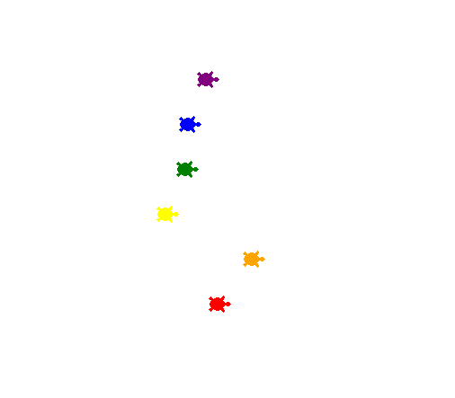

# Python GUI 

## Table of Content
* [Environment](#environment)
* [File Descriptions](#file-descriptions)
* [Authors](#authors)

## Environment
This project is interpreted/tested on Ubuntu 22.04 LTS using python3. 

## File Descriptions
[main.py](main.py) 

## Authors
Yohanes Getinet - [Github](https://github.com/YohanesGetinet1) / [LinkedIn](https://www.linkedin.com/in/yohanesgetinet/)  
## Date 25/08/2022
